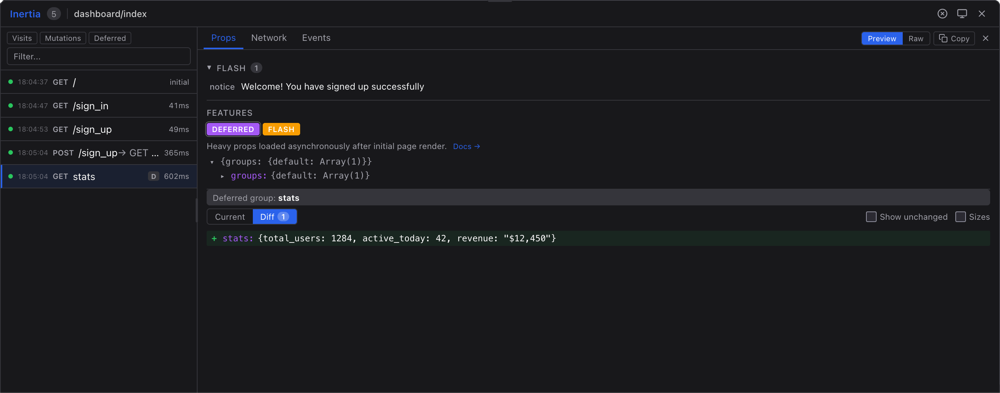

# Inertia DevTools

In-app developer tools for [Inertia.js](https://inertiajs.com/) v3.4+. See what happens behind every click.

<p align="center">
  
</p>

## Installation

```sh
npm install inertia-devtools --save-dev
```

## Quick Start

### With Vite (recommended)

Add the plugin to your `vite.config.ts`:

```ts
import { defineConfig } from 'vite'
import { inertiaDevtools } from 'inertia-devtools/vite'

export default defineConfig({
  plugins: [
    inertiaDevtools(),
    // ... other plugins
  ],
})
```

The plugin auto-injects devtools into your Inertia entrypoint and strips them from production builds automatically.

### Without Vite

Import and initialize manually:

```ts
import { createInertiaDevtools } from 'inertia-devtools'

if (process.env.NODE_ENV === 'development') {
  createInertiaDevtools()
}
```

## Features

### Props Inspector

Browse page props in an expandable tree. Toggle byte sizes per prop.

### Props Diff

Compare props between navigations. Added, removed, and changed keys are highlighted with a change count badge.

### Network Tab

Actual HTTP request/response data from the wire: status codes, request and response headers (`X-Inertia-*` highlighted), timing, and payload size — captured via Inertia's dev-mode interceptors. When interceptors are unavailable, falls back to timing-only data with protocol fields inferred from client-side state.

### Events Timeline

Full Inertia lifecycle in chronological order:

```
before → start → navigate → success → finish
```

Includes visit options (`replace`, `preserveState`, `errorBag`, etc.) and expandable raw event data.

### Feature Detection

Badges appear automatically for active Inertia features:

| Badge         | Feature                            |
| ------------- | ---------------------------------- |
| PARTIAL       | Partial reload (`only` / `except`) |
| DEFERRED      | Deferred props                     |
| MERGE         | Merge strategy                     |
| DEEP MERGE    | Deep merge strategy                |
| PREPEND       | Prepend strategy                   |
| SCROLL        | Scroll regions                     |
| ONCE          | Once props                         |
| PREFETCH      | Prefetched request                 |
| CACHED        | Served from the prefetch cache     |
| FLASH         | Flash data present                 |
| REMEMBER      | Remembered local state             |
| ENCRYPTED     | Encrypted history                  |
| CLEAR HISTORY | History cleared on this page       |

Each badge links to the relevant documentation page.

### Request Filtering

Toggle visibility by category: visits, mutations, partial, deferred, prefetch, and client-side visits.

### Copy as Markdown

Copy structured context (summary, props diff, errors, features) for GitHub issues or AI chats.

### More

- **Dark/light/system theme** with manual override
- **Keyboard navigation** -- arrow keys to browse requests, Escape to deselect
- **Previous session** -- requests from before page reload in a collapsible section
- **Draggable trigger** -- floating icon with position persisted to localStorage
- **Shadow DOM isolation** -- styles never leak into your app
- **Framework agnostic** -- works with React, Vue, and Svelte

## Options

```ts
createInertiaDevtools({
  styleNonce: 'abc123', // CSP nonce for Shadow DOM styles
  enabled: true, // set to false to disable
  docsProvider: 'inertiajs', // or 'inertia-rails'
})
```

## How It Works

Listens to Inertia DOM events and correlates them into request records by visit id. Client-side visits (`router.push`/`replace`/`replaceProp`/...) arrive via the `inertia:clientVisit` event. Network data (headers, status, body size) comes from Inertia's dev-mode interceptors (`window.__inertia_interceptors__`, exposed when `createInertiaApp`'s `dev` option is on — the default in Vite dev mode), with PerformanceObserver supplying resource timing and acting as the fallback. Nothing is monkey-patched.

The UI renders inside a Shadow DOM -- your app styles are never affected. State is kept in a bounded buffer (200 requests max).

## Requirements

- [Inertia.js](https://inertiajs.com/) v3.4+
- Modern browser (ES2020+)

### Version compatibility

| inertia-devtools | Inertia.js     |
| ---------------- | -------------- |
| 0.2.x            | >= 3.4         |
| 0.1.x            | v2.x, v3.0–3.3 |

## Development

```sh
npm install
npm test
npm run build
```

## License

MIT
